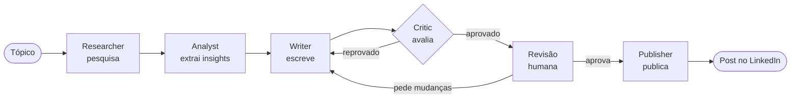

# Solera

**Uma equipe de agentes de IA que escreve posts para o LinkedIn — e uma pessoa que decide o que vai ao ar.**

O Solera pesquisa um tema, organiza o que encontrou, escreve o post, avalia o próprio texto e só publica depois da aprovação de um revisor humano. O projeto também serve de base a um estudo acadêmico: até que ponto um agente avaliador concorda com a opinião de pessoas reais sobre os mesmos posts?

---

## Índice

1. [O que é o Solera](#o-que-é-o-solera)
2. [Como um post nasce](#como-um-post-nasce)
3. [Os agentes](#os-agentes)
4. [Prompts dos agentes](#prompts-dos-agentes)
5. [Como a qualidade é avaliada](#como-a-qualidade-é-avaliada)
6. [O estudo: o Critic concorda com as pessoas?](#o-estudo-o-critic-concorda-com-as-pessoas)
7. [O que há neste repositório](#o-que-há-neste-repositório)
8. [Para rodar localmente](#para-rodar-localmente)

---

## O que é o Solera

Escrever um bom post profissional dá trabalho: é preciso saber do assunto, escolher um ângulo, escrever de um jeito que prenda e revisar antes de publicar. O Solera divide esse trabalho entre agentes especializados, cada um responsável por uma etapa, e mantém uma pessoa no controle da decisão final.

Três ideias guiam o projeto:

- **Cada agente faz uma coisa só.** Quem pesquisa não escreve; quem escreve não se avalia.
- **A avaliação automática é um filtro, não a palavra final.** O agente avaliador pode mandar o texto de volta para ser reescrito, mas nenhum post é publicado sem aprovação humana.
- **Tudo fica registrado.** Cada versão do texto e cada avaliação são guardadas, o que permite estudar o comportamento do sistema depois.

## Como um post nasce

1. **Você escolhe o tópico** e o tamanho do post.
2. **O Researcher pesquisa** fontes recentes na web, em português e em inglês.
3. **O Analyst lê as fontes**, descarta o que é irrelevante ou propaganda e separa os pontos que valem um post.
4. **O Writer escreve** o post a partir desses pontos.
5. **O Critic avalia** o texto. Se a nota não for suficiente, o post volta ao Writer com as críticas — no máximo três vezes.
6. **Uma pessoa revisa.** Pode aprovar, pedir mudanças com um comentário ou cancelar.
7. **O Publisher publica** o post aprovado no LinkedIn.

## Os agentes

| Agente | Papel | Prompt |
|---|---|---|
| **Researcher** | Busca fontes relevantes e recentes sobre o tópico | [ver prompt](prompts/01-researcher.md) |
| **Analyst** | Filtra as fontes e extrai de 3 a 5 insights | [ver prompt](prompts/02-analyst.md) |
| **Writer** | Escreve o post e as reescritas pedidas | [ver prompt](prompts/03-writer.md) |
| **Critic** | Dá notas ao post e aponta o que melhorar | [ver prompt](prompts/04-critic.md) |
| **Revisão humana** | Aprova, pede mudanças ou cancela | — |
| **Publisher** | Publica o post aprovado no LinkedIn | — |

O *Critic* aparece como **Judge** no código e na interface.

## Prompts dos agentes

Os prompts completos ficam na pasta [`prompts/`](prompts/README.md), um arquivo por agente, com o texto integral enviado ao modelo, o que entra em cada execução e as variações (reescrita, revisão humana, tamanho do post). É esta pasta que o artigo cita.

| # | Documento | Seções principais |
|---|---|---|
| — | [Índice dos prompts](prompts/README.md) | [como ler](prompts/README.md#como-ler-estes-prompts) · [versões e relação com o estudo](prompts/README.md#versões-e-relação-com-o-estudo) |
| 01 | [Researcher](prompts/01-researcher.md) | [prompt de sistema](prompts/01-researcher.md#prompt-de-sistema) · [ferramenta de busca](prompts/01-researcher.md#ferramenta-de-busca) |
| 02 | [Analyst](prompts/02-analyst.md) | [prompt de sistema](prompts/02-analyst.md#prompt-de-sistema) · [mensagem do usuário](prompts/02-analyst.md#mensagem-do-usuário) |
| 03 | [Writer](prompts/03-writer.md) | [prompt de sistema](prompts/03-writer.md#prompt-de-sistema) · [reescrita após o Critic](prompts/03-writer.md#reescrita-após-reprovação-do-critic) · [revisão humana](prompts/03-writer.md#revisão-pedida-pelo-humano) · [faixas de tamanho](prompts/03-writer.md#faixas-de-tamanho) |
| 04 | [Critic](prompts/04-critic.md) | [prompt de sistema](prompts/04-critic.md#prompt-de-sistema) · [retentativa de coerência](prompts/04-critic.md#retentativa-de-coerência) |
| 05 | [Rubrica e regra de aceitação](prompts/05-rubrica-e-regra-de-aceitacao.md) | [dimensões](prompts/05-rubrica-e-regra-de-aceitacao.md#dimensões) · [regra de aceitação](prompts/05-rubrica-e-regra-de-aceitacao.md#regra-de-aceitação) |

Os prompts estão em português, o idioma em que rodaram. A pasta é gerada a partir do próprio sistema — não é uma cópia feita à mão —, então o que está ali é o que os agentes recebem.

🌐 **English translation.** Todos os documentos acima têm tradução para o inglês em [`prompts/en/`](prompts/en/README.md), com a mesma estrutura: [Researcher](prompts/en/01-researcher.md) · [Analyst](prompts/en/02-analyst.md) · [Writer](prompts/en/03-writer.md) · [Critic](prompts/en/04-critic.md) · [Rubric](prompts/en/05-rubric-and-acceptance-rule.md). O original em português continua sendo a referência; se um prompt mudar e a tradução não for revisada, a página em inglês avisa.

## Como a qualidade é avaliada

O Critic e os avaliadores humanos usam a mesma régua: uma nota de 1 (muito ruim) a 5 (excelente) em quatro aspectos, cada ponto da escala com uma descrição do que significa.

| Aspecto | A pergunta por trás da nota |
|---|---|
| **Clareza** | O texto é fácil de ler e entender? |
| **Relevância** | Traz informação que vale o tempo de um profissional? |
| **Adequação profissional** | O tom combina com uma rede profissional? |
| **Engajamento** | Prende a atenção e convida a uma conversa de verdade? |

Depois dos quatro aspectos vem uma nota geral. A aprovação não é decidida pelo Critic: ela sai de uma conta feita sobre as notas, em que clareza e relevância pesam mais. A régua completa, com a descrição de cada ponto, está em [Rubrica e regra de aceitação](prompts/05-rubrica-e-regra-de-aceitacao.md).

## O estudo: o Critic concorda com as pessoas?

Um agente que avalia texto é barato e rápido, mas só serve como filtro se as notas dele acompanharem o julgamento de quem vai ler. Para verificar isso, **18 pessoas** avaliaram **10 posts** gerados pelo sistema, com a mesma régua usada pelo Critic e sem ver as notas dele.

**O que encontramos:**

- **As notas do Critic coincidiram com as das pessoas tanto quanto coincidiriam por acaso.** A concordância parecia razoável, mas é a mesma que se obtém sorteando notas com a mesma distribuição.
- **As pessoas também não concordaram entre si.** Os dez posts pareceram quase igualmente bons para os avaliadores; o que mais variou foi o quanto cada pessoa é exigente, não o post avaliado.
- **O Critic é consistente**: avaliando o mesmo texto várias vezes, dá praticamente a mesma nota. E percebe quando o texto é mutilado — reprovou 8 de 10 posts cortados a um terço do tamanho.
- **O Critic é mais rigoroso que as pessoas** em relevância e na nota geral, mas dá quase a mesma nota a todos os posts bons.

**A lição:** avaliar um agente avaliador apenas com textos que o próprio sistema já aprovou não mostra se ele concorda com as pessoas, porque esses textos são parecidos demais entre si. Para isso é preciso incluir textos de qualidade bem variada.

Os detalhes estão no artigo e nos dados:

| O quê | Onde |
|---|---|
| Artigo (LaTeX) e registro das mudanças | [`study/artigo-icaart-2027/`](study/artigo-icaart-2027/) · [CHANGES.md](study/artigo-icaart-2027/CHANGES.md) |
| Respostas do formulário e notas do Critic | [`study/data/`](study/data/README.md) |
| Scripts da análise | [`study/analysis/`](study/analysis/README.md) |

## O que há neste repositório

| Pasta | Conteúdo |
|---|---|
| [`prompts/`](prompts/README.md) | Prompts completos dos agentes e a rubrica de avaliação |
| [`src/app/MAS/`](src/app/MAS/) | Os agentes e o fluxo que os coordena |
| `src/app/(dashboard)/` | A interface: criação de posts, revisão, estudo, configurações |
| [`study/`](study/) | Artigo, dados coletados e análise |
| [`scripts/`](scripts/) | Tarefas de apoio: gerar e reavaliar o corpus, exportar dados e prompts |
| [`drizzle/`](drizzle/) | Estrutura do banco de dados |

## Para rodar localmente

O Solera é uma aplicação web em Next.js que usa PostgreSQL e a API da OpenAI.

1. Instale as dependências com `pnpm install`.
2. Crie um arquivo `.env.local` com as variáveis abaixo.
3. Aplique as migrações da pasta [`drizzle/`](drizzle/) no banco.
4. Rode `pnpm dev` e acesse `http://localhost:3000`, entrando com sua conta do LinkedIn.

| Variável | Para quê |
|---|---|
| `DATABASE_URL` | Conexão com o PostgreSQL |
| `OPENAI_API_KEY`, `LLM_MODEL` | Acesso aos modelos e modelo padrão dos agentes |
| `TAVILY_API_KEY` ou `BRAVE_API_KEY` | Busca na web do Researcher |
| `LINKEDIN_CLIENT_ID`, `LINKEDIN_CLIENT_SECRET`, `LINKEDIN_REDIRECT_URI` | Login e publicação pelo LinkedIn |
| `SESSION_SECRET` | Assinatura da sessão de login |
| `LANGCHAIN_API_KEY` | Opcional: rastreamento das execuções no LangSmith |
| `OWNER_ID` | Usado pelos scripts do estudo para identificar o dono das execuções |

Comandos úteis:

| Comando | O que faz |
|---|---|
| `pnpm prompts:export` | Gera de novo a pasta `prompts/` a partir do sistema |
| `pnpm study:critic-form` | Exporta as notas do Critic dos posts do formulário |
| `python study/analysis/form_agreement.py` | Refaz a análise e as tabelas do artigo |
